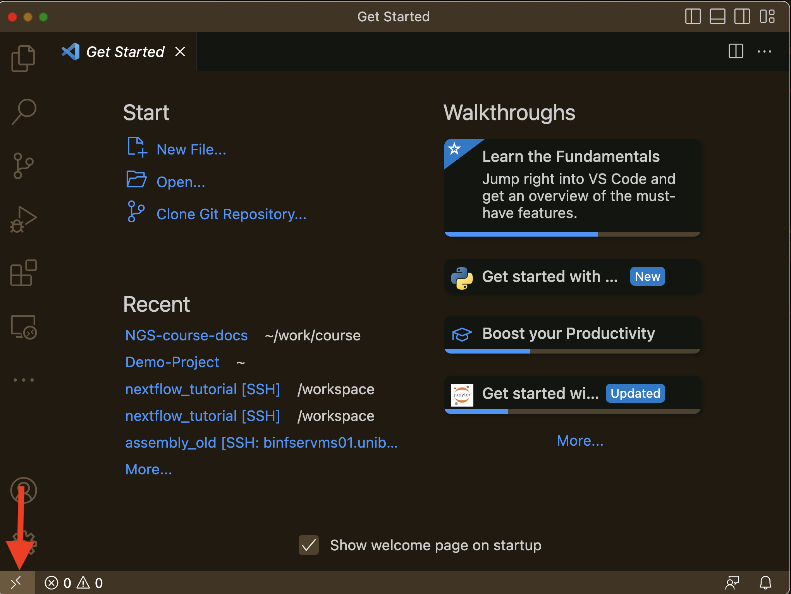
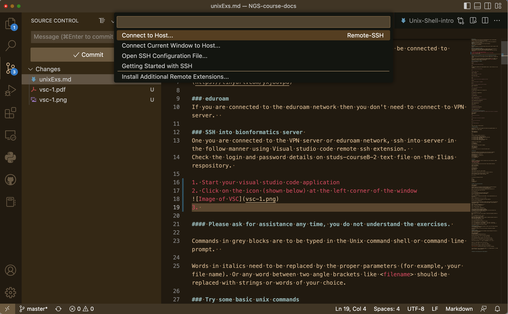
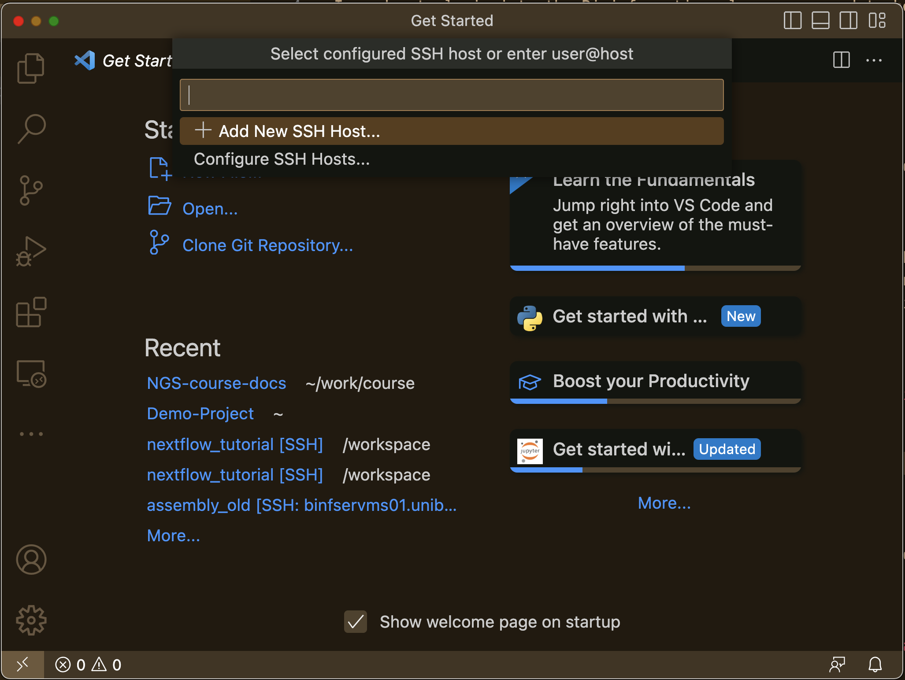
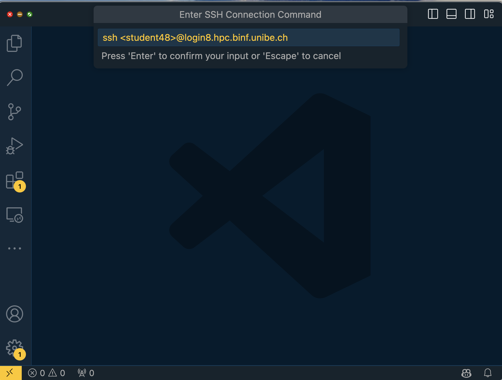
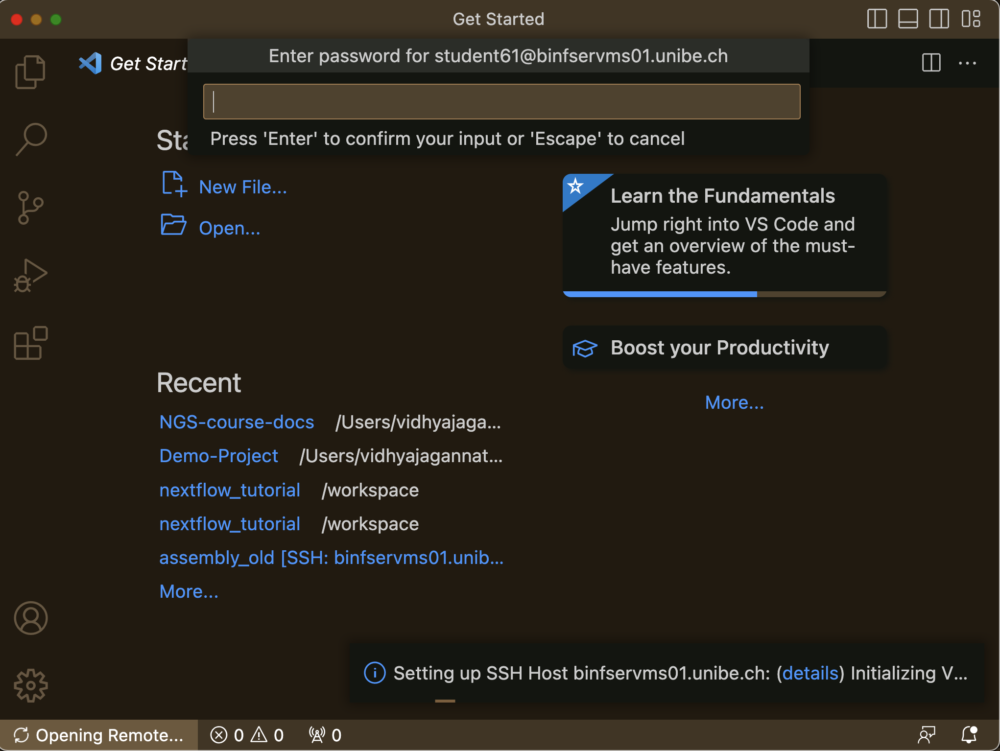
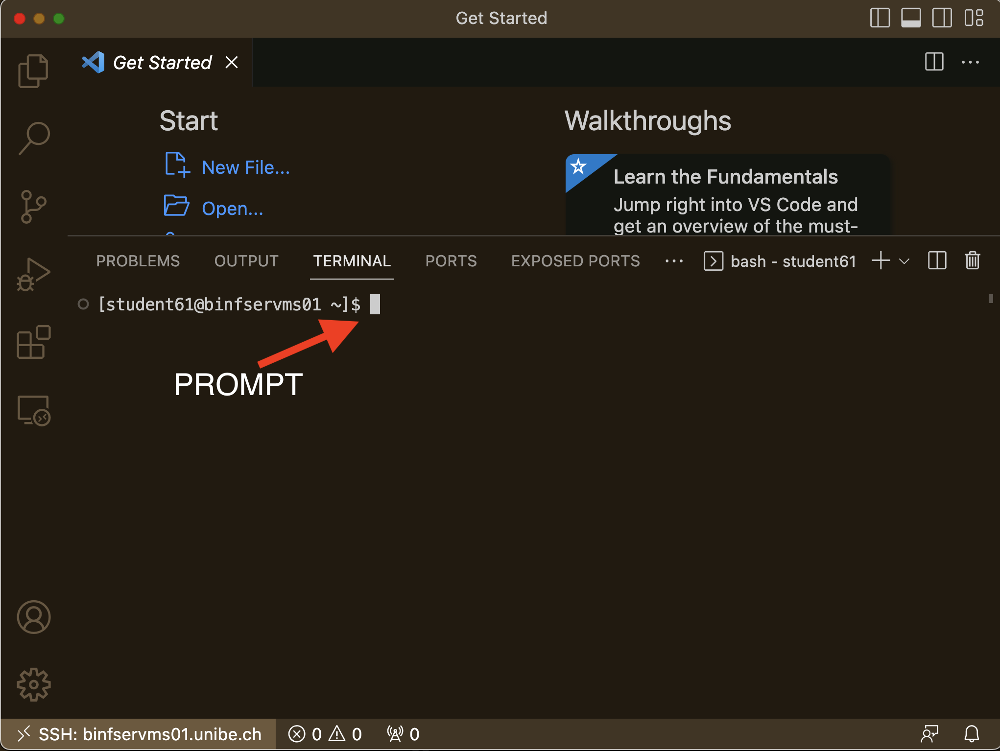

## Unix Exercises

### 🧠 Learning Objectives

- Connect to the university HPC cluster using VPN, eduroam, and SSH (via VS Code).
- Work efficiently on a remote server using VS Code’s Remote SSH tools.
- Navigate the Unix file system using basic shell commands.
- Manage files and permissions on a Unix system.
- Apply basic UNIX text manipulation to real biological datasets.
- Combine commands using **pipes (`|`)** for efficient data processing.  

###  1️⃣ Network Connection

#### VPN
Please login into the unibe VPN server using [_FortiConnect_].
(https://tinyurl.com/yxj8ovpd)

#### eduroam
**If you are connected to the eduroam network then you don't need to connect to VPN server.**

###  2️⃣ Connect to HPC cluster

#### SSH into HPC cluster
After connecting to either the VPN server or eduroam network, use Visual Studio Code's Remote SSH extension to access the server.

Check the login and password details on students-passwords text file on the Ilias respository (https://ilias.unibe.ch/goto_ilias3_unibe_file_3222705_download.html).

#### Steps to Connect

1. Start your **Visual Studio Code** application.  
2. Click on the **Remote Explorer** icon (shown below) on the left side of the window.  

   
3. A sub-window opens. Click **Connect to Host**.  

   
4. In the next window, click **Add New SSH Host**.  

   
5. Enter the login details as shown below (replace with your assigned student ID).  

   
6. Click **Connect** and enter your password when prompted.  

   
7. Open a new terminal by selecting **Terminal → New Terminal**.  

   

### Notes

💡 **Ask for assistance** at any point if something is unclear — the goal is to learn by doing!  

- Commands shown in grey blocks should be typed in the **Unix terminal**.  
- Words in *italics* or enclosed in `<angle brackets>` (e.g., `<filename>`) should be replaced by your own parameters such as file names or paths.

---

### 3️⃣ Basic UNIX Commands

1. *Display user name*
```shell
whoami
```

2. *Show the current working directory*
```shell
pwd
```

It should show something like /home/student36. Which is 'home' directory for user student36

3. *List the files in the directory*
```shell
ls
```

4. *Create a empty file*
```shell
touch <filename>
```
replace <filename> with your own filename (of choice)

5. *Print a string to the screen*
```shell
echo "Hello world"
```

6. *Print the current date*
```shell
date
```

7. *See a history of all the last commands you tried*
```shell
history
```

8. *Get local help page of a command*
```shell
man ls
```
press q to exit the man page.

9. *Run the following commands one after another*
```shell
touch <exampleFile>
ls
```
replace \<exampleFile\> with your own filename (of choice)

10. *Print the contents of the file*
```shell
cat <exampleFile>
```
replace \<exampleFile\> from the before command.
It should show no lines as it is an empty file.

11. *Rename a file*
```shell
mv <exampleFile> <exampleFile2>
```
replace \<exampleFile1\> and \<exampleFile2\> with your own filename (of choice)

12. *Delete a file*
```shell
rm <exampleFile2>
```
replace \<exampleFile2\> from the before command.

13. *Create a new folder/directory*
```shell
mkdir <exampleDirectory>
```

14. *Create a file under the new folder/directory*
```shell
touch exampleDirectory/exampleFile
```

15. *Delete the folder/directory*
```shell
rmdir exampleDirectory
```
Worked? No! 😅
That’s because rmdir only removes empty directories.

16. *Delete the file inside the directory first*
```shell
rm exampleDirectory/exampleFile
```

17. *Delete the directory now*
```shell
rmdir exampleDirectory
```

### 4️⃣ Creating and moving around Directories
1. *Create a directory called 'Documents' and change current directory to Documents*
```shell
mkdir Documents
cd Documents
pwd
```

2. *Going up one directory*
```shell
cd ..
```

3. *and then type to see what has happened*
```shell
pwd
```

4. *Go up by two directories*
```shell
cd ../..
pwd
```

5. *Go to home or user directory*
```shell
cd
```
Always type “pwd” to locate yourself

### 5️⃣ Command arguments

Most programs in UNIX accept arguments that modify the program’s behavior. For example
1. List the files in longer format

```shell
ls -l
touch exampleFile1
touch exampleFile2
ls
ls -l
```
```text
Different example parameters used with ls
| Command | Description |
|----------|-------------|
| `ls -a` | List all files, including hidden ones |
| `ls -h` | Show file sizes in human-readable format (KB, MB, GB) |
| `ls -l` | Long format — permissions, owner, size, date |
| `ls -S` | Sort files by size |
| `ls -t` | Sort files by modification time |
| `ls -1` | Display one file per line |
```
2. *Parameters for remove command*
```shell
rm exampleFile1
rm -i exampleFile2
```

3. Aliases are short forms used for commands.
```shell
alias rm=”rm -i”
touch <exampleFile>
rm <exampleFile>
```
So better to alias rm as rm -i to be on the safer side ?.

### 6️⃣ Redirection and Pipes.

1. *Understand input/output redirection and how to connect commands with pipes.*

All the above commands sent the output if any to the screen. Instead of outputting on the screen redirection helps you to put into a file
```shell
echo "My first line" >testFile.txt
cat testFile.txt
echo "My second line" >>testFile.txt
cat testFile.txt
ls / >> ListRootDir.txt
cat ListRootDir.txt
```

### 7️⃣ Wildcards

wildcard is a symbol that is used to represent one or more characters. Example wildcards are as follows
- \* Zero or more characters
- ? Any single character.

In the following examples you can test some of these wildcard characters

1. Create a new folder
```bash
cd 
mkdir wildCardTesting
```
Run the _cd_ command to make sure you are in the home/user directory.
2. Change directory
```shell
cd wildCardTesting
touch test1.txt
touch test2.txt
```
3. Create several files with a single command
```shell
touch test3.txt test4.txt test1.csv test2.csv test3.csv test4.csv
```
4. Count the number of files using the pipes ( \| symbol)

```bash
wc –l 
```

```shell
ls -l | wc -l
```
5. Try using the following wild cards
```shell
ls *
ls test*
ls *.txt
ls *.csv
ls test[1-2].txt
ls test[!3].*
```

### 8️⃣ Text Manipulation

1. Create a new folder called GenomeStats in your home/user directory to run the exercise.

```shell
cd 
mkdir GenomeStats
cd GenomeStats
```

2. Download the text file showing the available refseq genomes for different species at NCBI https://www.ncbi.nlm.nih.gov/genome/browse/
RefSeq Genomes on NCBI are high-quality reference genome sequences that serve as standard representations for the genetics of specific organisms
```shell
wget https://ftp.ncbi.nlm.nih.gov/genomes/refseq/assembly_summary_refseq.txt
```

3. Use less to have a quick view of the file
```shell
less assembly_summary_refseq.txt
#Press q to exit the less interface and come back to prompt.
```

4. It is a tab delimited text file with several columns.
The second line shows the different column headers
```shell
head -n 2 assembly_summary_refseq.txt | tail -n 1
```

5. For further ease of reading the column headers. (Do you understand what we are doing here ?)
```shell
head -n 2 assembly_summary_refseq.txt | tail -n 1 | tr '\t' '\n' |less
#Press q to exit the less interface and come back to prompt
head -n 2 assembly_summary_refseq.txt | tail -n 1 | tr '\t' '\n' |nl |less
#Press q to exit the less interface and come back to prompt
```

6. Lets check the number of dog genome assemblies that have been submitted to NCBI genome database.
```shell
awk -F'\t' '$8 == "Canis lupus familiaris" && $6 == "9615"' assembly_summary_refseq.txt
```
| Part                             | Meaning                                                                                                                  |   |                                                               |
| -------------------------------- | ------------------------------------------------------------------------------------------------------------------------ | - | ------------------------------------------------------------- |
| `awk`                            | Runs the AWK text processing tool.                                                                                       |   |                                                               |
| `-F'\t'`                         | Sets the **field separator** to a tab character, so AWK treats each column as tab-separated.                             |   |                                                               |
| `NR == 2`                        | `NR` means **Number of Record** — i.e., the current line number. This condition matches **the second line** in the file. |   |                                                               |
| `                                |                                                                                                                          | ` | Logical **OR** — at least one of the conditions must be true. |
| `$1 == "Canis lupus familiaris"` | Matches lines where the **first column** equals `"Canis lupus familiaris"`.                                              |   |                                                               |
| `$6 == "9615"`                   | Matches lines where the **sixth column** equals `"9615"`.                                                                |   |                                                               |
| `assembly_summary_refseq.txt`    | The input tab-delimited file.                                                                                            |   |                                                               |

7. Want to keep the header line ?
```shell
awk -F'\t' 'NR == 2 || ($1 == "Canis lupus familiaris" && $6 == "9615")' assembly_summary_refseq.txt
```
- NR == 2: NR is the current line number. NR == 2 allows the header line (second line) to be printed.
- `||` : Logical OR, so it matches either the header line or lines that meet the specified condition.

8. Lets do some statistics on available genomes.

How many Animal and plant genomes are available
cut command in unix can be used to select columns from tab de-limited files
Only the column _Group_ can selected using cut
```shell
cut -f25 assembly_summary_refseq.txt | less
```

9. By piping commands together (|), it's possible to get a count of the different RefSeq genomes at NCBI.
```shell
cut -f25 assembly_summary_refseq.txt | sort | uniq -c
```

10. To count the genome groups in column 25, we first need to skip the header line. The command also lists them, sorted from the most frequent group to the least frequent.
```shell
tail -n +3 assembly_summary_refseq.txt | cut -f25 | sort | uniq -c | sort -k1,1nr
```

- **tail -n +3** assembly_summary_refseq.txt: Outputs the file starting from the third line, effectively skipping the first two lines.
- **cut -f25**: Extracts the 25th column from the remaining lines.
- **sort**: Sorts the output to prepare for counting unique values.
- **uniq -c**: Counts occurrences of each unique value in the 25th column

** How many mammalian genomes are available ?**

11. You have already successfully found the frequency distribution of Genome Groups (column 25).
Now, create a new, single command chain that starts by selecting the three columns (8, 25, 28), yet still produces the exact same final frequency count of the Genome Groups as your previous command.
```shell
tail -n +3 assembly_summary_refseq.txt | cut -f 8,25,28 | ... assembly_summary_refseq.txt |less
```
**Challenge:** What modifications are necessary for the rest of the command chain (sort | uniq -c | sort -k1,1nr) to correctly process the Genome Group column, given that the input stream now only contains three fields?
11. Identify the mammalian species from the dataset tha has the highest GC content
```shell
cut -f 8,25,28 assembly_summary_refseq.txt | grep vertebrate_mammalian |sort -t$'\t' -nrk3 | less
cut -f 8,25,28 assembly_summary_refseq.txt | grep vertebrate_mammalian |sort -t$'\t' -nrk3 | head -n 1
```

- sort: Sorts the filtered results.
- -t$'\t': Sets the field delimiter as a tab ($'\t' is a literal tab in Unix shell).
- -nrk3: Specifies sorting by the 3rd column in numerical order (-n), in reverse order (-r), based on column 3 (-k3).
- Result: Sorts entries in descending order based on GC% values.

* Which Mammalian genome has the least GC content ? *

# Question of the day
Invertebrates generally have lower GC content compared to vertebrates.
You can check if this is true in your dataset
```shell
awk -F'\t' '$25 ~ /vertebrate_/ { total++; if ($28+0 < 40) count++ } END { print (count/total)*100, count, total }' assembly_summary_refseq.txt
awk -F'\t' '$25 ~ /invertebrate/ { total++; if ($28+0 < 40) count++ } END { print (count/total)*100, count, total }' assembly_summary_refseq.txt
```

- **total++:** If column 25 contains "vertebrate_" count total vertebrate genomes
- **$28+0:** converts column 28 (GC%) to a number.
- **count++:** if GC content (column 28) is < 40% Count these low-GC genomes
- **Output shows three numbers:**Percentage of vertebrate genomes with GC<40%, Count of low-GC genomes, Total vertebrate genomes

### 9️⃣ Sequence Content
1. Create a new directory and copy the chromosome  human chromosome 22 from here: /data/courses/courseB/UnixEx
```shell
cd
mkdir <directoryname>
cd <directoryname>
cp /data/courses/courseB/UnixEx/chr22.fa.gz  .
```

2. How many nucleotides are found in the entire chromosome?
```shell
less chr22.fa.gz | grep -v ">" | wc | awk '{print $3-$1}'
```
**Do you understand the above command. If not try man wc for help.**
3. How many As, Cs, Gs, Ts and Ns are found in the entire chromosome?
```shell
less chr22.fa.gz |grep -v ">" | grep -o [actgnACTGN] | sort | uniq -c
```

4. Search for  EcoR1 (GAATTC) site in the chr22 file
```shell
less chr22.fa.gz | grep -v ">" | grep --color "GAATTC"
```

5. Next, To  count the total number of EcoRI restriction sites in the sequence using the same _grep_ command, which of the following commands is correct? 
```shell
less chr22.fa.gz | grep -v ">" | grep -o "GAATTC" | wc -l 
less chr22.fa.gz | grep -v ">" | grep -c "GAATTC" 
```
**Do you understand the difference between the two commands.**

6. **For the brave.** Calculate the %GC content in the entire chromosome.

```shell
less chr22.fa.gz | awk '!/^>/{gc+=gsub(/[gGcC]/,""); at+=gsub(/[aAtT]/,"");} END{ printf "%.2f%%\n", (gc*100)/(gc+at) }'
```

### 🎉 *Welcome to the exciting world of Data Analysis!*