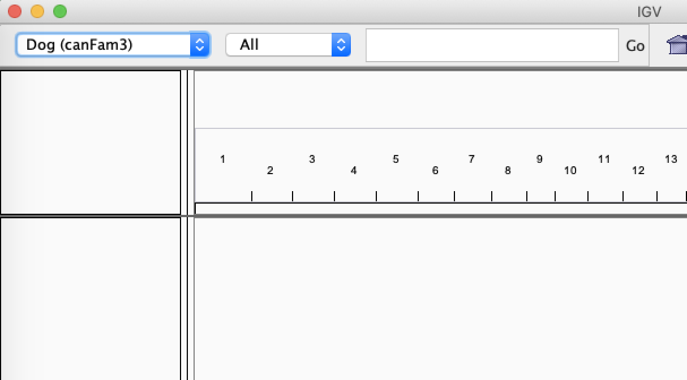
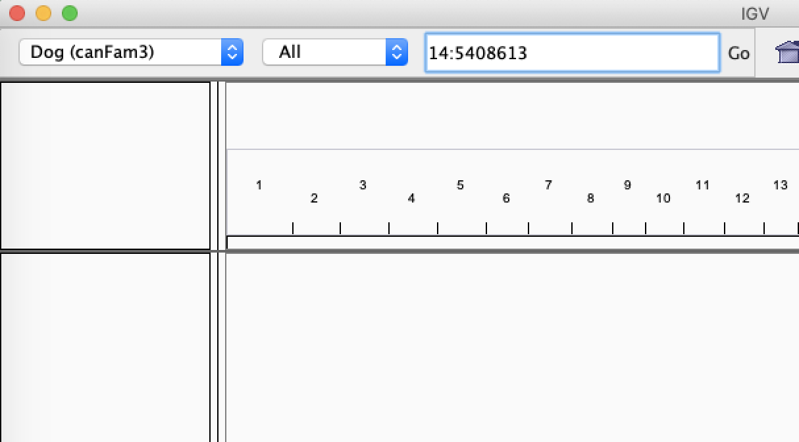

# Mapping Exercise

## 1️⃣ Index the reference genome
On the IBU bioinformatics server, make a new folder at course/variantCalling. Next, copy the reference file into this directory. We'll be running the mapping exercise here (variantCalling) because this reference file is also needed for the upcoming variant calling exercise.

```shell
cd course
mkdir variantCalling
cd variantCalling
mkdir -p refIdx mapping fastq_data scripts
cd refIdx
cp /data/courses/courseB/variantCalling/chr14.fa .
```
At the end of the day your directory should look like this:

```text
├── course
│   ├── variantCalling
|   |   ├── refIdx
|   |   |   └── chr14.fa
|   |   |   └── chr14.fa.amb
|   |   |   └── chr14.fa.ann
|   |   |   └── chr14.fa.bwt
|   |   |   └── chr14.fa.fai
|   |   |   └── chr14.fa.pac
|   |   |   └── chr14.fa.sa
|   |   |   └── chr14.dict
|   |   ├── fastq_data
|   |   |   └── BT012_R1.fastq.gz
|   |   |   └── BT012_R2.fastq.gz
|   |   |   └── BT134_R1.fastq.gz
|   |   |   └── BT134_R2.fastq.gz
|   |   |── mapping
|   |   |   └── BT012.sorted.bam
|   |   |   └── BT134.sorted.bam
|   |   |   └── BT012_mapping_stats.txt
|   |   |   └── BT134_mapping_stats.txt
|   |   ├── scripts
|   |   |   └── mapping.sh
|   |   |   └── flagstat.sh
```

We will use only chr14 of the dog genome as the reference just for short computing run times,so you can finish the exercises faster


We will use bwa algorithm for mapping the reads to the reference genome. Load the bwa module first and by typing bwa on the commmand line you get the help for bwa. The options for bwa are also available at http: //bio-bwa.sourceforge.net/bwa.shtml

```shell
module add BWA/0.7.17-GCC-10.3.0
bwa
```
Before aligning your reads, it's crucial to index the reference genome. Here's why:

- **Faster Alignment:** Indexing helps the aligner quickly locate potential alignment sites, saving significant time.
- **Reusability:** Once created, this index can be used for all bwa alignments to the same reference.
- **New Reference = New Index:** If you change your reference genome, you'll need to build a new index.

The Bash script below automates the indexing of a reference genome, a crucial setup step for many bioinformatics tools. It uses a suite of programs (BWA, Samtools, and GATK) to create the required index files (.bwt, .pac, .fai, .dict). These indexes are vital for efficient read mapping and for the proper function of tools like BWA and GATK in later steps (e.g., variant calling).

Replace the email id with your own email id. If you don't want to be emailed about the process, you can remove it.

```shell
# !/bin/bash
# Slurm options
#SBATCH --mail-user=<your.email@example.com>
#SBATCH --mail-type=fail,end
#SBATCH --job-name="idxRef"
#SBATCH --chdir=.
#SBATCH --time=1:00:00
#SBATCH --mem=5G
#SBATCH --cpus-per-task=1
#SBATCH -p pcourseb
#SBATCH --output=idxRef_%j.out
#SBATCH --error=idxRef_%j.err

module add BWA/0.7.17-GCC-10.3.0
module load SAMtools/1.13-GCC-10.3.0
module load GATK/4.2.6.1-GCCcore-10.3.0-Java-11
module load Java/17.0.6

bwa index -a bwtsw -p chr14.fa chr14.fa
samtools faidx chr14.fa
gatk CreateSequenceDictionary R=chr14.fa O=chr14.dict
```

Questions:
1. What does the %j variable represent in this script ?
2. What is the output of samtools faidx ?

 Check if the following files are produced.
- bwa index will produce the following files with the extensions
- *.amb  *.ann  *.bwt  *.pac  *.sa
- samtools faidx will produce an index file *fai.
- gatk will produce the *.dict file.

## 2️⃣ Mapping

The mapping exercise will utilize the BWA-MEM algorithm, which is the current industry-standard and most popular tool for high-quality sequence alignment. It has not been formally published in a peer-reviewed journal.

##### Genome reads
Create and directory called fastq_data.
```shell
mkdir -p course/variantCalling/fastq_data
```
Copy the sample genome illumina reads for two  Bull Terriers dogs to the mapping directory. The Bull Terriers samples are named as:
1. BT012
2. BT134

```shell
cd course/variantCalling/fastq_data
cp /data/courses/courseB/variantCalling/*.gz .

```

Questions:
1. How many files got copied ?
2. what is the format of the files ?
3. What sequencing type was used: single-end or paired-end ?

### Mapping Reads: From Three Steps to One Streamlined Command
The complete read mapping workflow typically involves three distinct steps: alignment, format conversion, and sorting.
*Traditional (Inefficient) Three-Step Process:*
1. **Map Reads:** Align the reads to the indexed reference genome using bwa mem, saving the output as a SAM file.
```shell
bwa mem -t 8 -M -R '@RG\tID: 2019111402\tPL: illumina\tPU: HHV75DSXX.4\tCN: UBern\tLB: BT134-LIB\tSM: BT134'  chr14.fa  BT134_R1.fastq.gz BT134_R2.fastq.gz >BT134.sam
```
2. **Convert to BAM:** Convert the text-based SAM file to the compressed, binary BAM format using samtools view.
```shell
samtools view -@8 -h -Sb -o BT134.bam BT134.sam
```
3. **Sort BAM:** Sort the BAM file based on chromosome coordinates using samtools sort.
```shell
samtools sort -@8 BT134.bam BT134.sorted.bam
```
⚠️ **DO NOT EXECUTE THESE STEPS**. This process requires extensive reading and writing to the hard disk, making it highly time-consuming.

### The Optimized Piping Solution
We will leverage the Unix piping (|) feature to combine the alignment, conversion, and sorting into a single, highly efficient command. This avoids creating the intermediate SAM and unsorted BAM files on the disk, saving significant I/O time.

The following integrated Bash/Slurm script performs the entire mapping workflow:
```shell
# !/bin/bash
# Slurm options
#SBATCH --mail-user=<your.email@example.com>
#SBATCH --mail-type=fail,end
#SBATCH --job-name="mapping"
#SBATCH --chdir=.
#SBATCH --time=3:00:00
#SBATCH --mem-per-cpu=2G
#SBATCH --cpus-per-task=8
#SBATCH -p pcourseb
#SBATCH --output=mapping_%j.out
#SBATCH --error=mapping_%j.err

module load BWA/0.7.17-GCC-10.3.0
module load SAMtools/1.13-GCC-10.3.0

bwa mem -t 8 -M -R '@RG\tID: 2024111301\tPL: illumina\tPU: HHV75DSXX.4\tCN: UBern\tLB: BT134-LIB\tSM: BT134'  ../refIdx/chr14.fa  BT134_R1.fastq.gz BT134_R2.fastq.gz | samtools sort -@8 -m 5G  -o ../mapping/BT134.sorted.bam -
samtools index ../mapping/BT134.sorted.bam
```

- The - symbol in the command indicates that samtools sort is taking its input directly from the previous command, not from a separate file. This is called piping.
- After sorting, use samtools index to create an index for the BAM file. This is essential for subsequent steps like visualization and variant calling.

###### ReadGroup
- -R option is used to add read group information to the alignment output.i.e Adds RG tag to each read in SAM/BAM output
- Every aligned read gets tagged with the RG: Z: ID value

Below is the breakdown to the tag used in the script
- @RG: This indicates a Read Group header line. Read groups are used to separate different sets of reads, typically from the same sample but perhaps from different lanes or libraries.
- ID: 2024111301 : Unique identifier for this read group. I usally use the date format 2024-11-13 with suffix 01. The Suffix if the number of sample mapped within the script. I usally map 50-100 samples per script or at one time.
- PL: illumina : Platform used for sequencing. In this case, Illumina sequencing technology
- PU: HHV75DSXX.4 : Platform Unit (typically flowcell + lane)  HHV75DSXX is the flowcell ID and .4 indicates lane 4
- CN: UBern : Sequencing Center that produced the data. In this case, University of Bern
- LB: BT134-LIB : Library identifier
- SM: BT134 Sample identifier. The dog id  BT134

##### Launch the mapping script

```shell
sbatch mapping.sh
```

### 2.1 Task

Repeat the mapping step with the second Bull Terrier sample BT012.

## 3️⃣ Quality Control
After your mapping job finishes, run samtools flagstat to perform a quick quality control (QC) check on your BAM file. This provides rapid feedback on key alignment metrics such as the number of mapped reads, paired-end success, and duplicate status—essential for spotting major issues immediately

1. As a first check after alignment to quickly assess:

- How many reads were successfully mapped
- Quality of paired-end mapping
- Presence of duplicates
- Failed QC reads

2. For troubleshooting when:

- Suspecting alignment problems
- Checking if paired-end data is properly handled
- Verifying if duplicate marking worked

While flagstat is a fast way to spot major alignment issues before moving to variant calling, it does not provide a comprehensive data quality report.

Below is the bash script to run flagstat on the BAM files

```
# !/bin/bash
# Slurm options
#SBATCH --mail-type=fail,end
#SBATCH --job-name="flagstat"
#SBATCH --chdir=.
#SBATCH --time=3:00:00
#SBATCH --mem-per-cpu=2G
#SBATCH --cpus-per-task=8
#SBATCH -p pcourseb

module load SAMtools/1.13-GCC-10.3.0
samtools flagstat -@ 8 ../mapping/BT012.sorted.bam > ../mapping/BT012_mapping_stats.txt
samtools flagstat -@ 8 ../mapping/BT134.sorted.bam > ../mapping/BT134_mapping_stats.txt

```

## 4️⃣ Visualizing the mapping

Task :
- Before visualization, you need to log in interactively to a computing node where the required resources are available. Use the srun command below, which will specifically log you onto a compute node, where pcourseb partition only runs.

```shell
srun --partition=pcourseb  --time=1: 00: 00 --mem=10G --pty /bin/bash
```

Mapping can be visualized using several tools. We will use samtools tview and IGV browser in the exercise.

### 4.1 Samtools tview
Samtools implements a very simple text alignment viewer called tview. It uses different colors to display mapping quality or base quality, according to users’ choice. Its easy to view the alignent over the network due its text interface for  displaying alignments.

_samtools tview_ takes as input the bam file and reference file

```shell
module load SAMtools/1.13-GCC-10.3.0
samtools tview BT134.sorted.bam ../refIdx/chr14.fa
```

tview commands:
1. left and right arrows scroll
2. press ‘?’ in the viewer for help
3. '.' to toggle between dot and nucleotide views.
4. CTRL-h and CTRL-l do “big” scrolls
5. q to quit
6. Typing g allows you to go to a specific location, in this format chromosome: location:
- 14: 5408613 (shows reference allele is **G**  and **CTT** a insertion in the sample genome.)
- 14: 5731405 (shows reference allele is **T** replaced by alternate allele **G**)
- 14: 5822263

### 4.2 IGV browser

IGV browser is another light visualizing tool for mapping. You must have installed the IGV browser in your system as we requested.
In order to see the mapping in an IGV browser we need  the bam file  and its corresponding index file. These files on made available for you on bioinformatics cloud.

Create a directory called _bamFiles_ on your local machine and download the bam files and index files to this directory from the below links:

```
https://cloud.bioinformatics.unibe.ch/index.php/s/RnkHzP8JZaHSBog
https://cloud.bioinformatics.unibe.ch/index.php/s/HcoWDAFCgkSrSFH
https://cloud.bioinformatics.unibe.ch/index.php/s/4nqE2NA5iPX69gT
https://cloud.bioinformatics.unibe.ch/index.php/s/MipC6fGSoA5c7TX
```

Type IGV on the windows search tool and open the IGV browser.

###### Load the reference genome
By default, IGV loads Human hg19 or the last genome used on the browser. If the genome is not dog or canFam3, we  load the reference genome  canFam3:


if you cannot see the canFam3, click on more and search for canFam3.

#### Visualizing read alignments
 IGV choose File > Load from File..., select the Bull Terrier bam file, and click OK. Note that the bam and index files must be in the same directory for IGV to load these properly.

 In the Navigation window (as shown below) repeat and visualize the co-ordinates as we used in samtools tview

 
 More information on IGV browsers can be obtained here
 https: //software.broadinstitute.org/software/igv/UserGuide

 Question:
 1. What is the first histogram track of IGV ?
 2. Try loading both the bam files of the Bull Terriers.

 We will continue with the same bam files for Variant calling and see if the variant calling algorithms find the Variants that you visualized.

## 5️⃣ Adding Version Control to Your mapping scripts.
1. Change the current working directory to "course"
2. Edit `.gitignore`  file with VScode

```shell
cd ~/course
code .gitignore

```

Add the following lines

```text
# reference files
*.fa
*.fasta
*.fa.fai
*.dict

# BWA index files
*.amb
*.ann
*.bwt
*.pac
*.sa

# Large binary files
*.bam
*.bai
*.sam

# Results and logs
*.log
```

3. Add and commit the .gitignore file

```shell
git add .gitignore
git commit -m "Add gitignore for bioinformatics files"
```

#### Track Your Mapping Scripts and Directory Structure

```shell
git add variantCalling/
git commit -m "Add variant calling directory structure"
```

#### Document Your Workflow
Edit the README.md file in your course directory

```shell
code README.md
```

Append the following lines

```text
# Variant Calling Workflow

## Directory Structure
- refIdx/: Reference genome and BWA indices
- mapping/: Read mapping results and scripts

## Analysis Steps
1. Reference Indexing
   - Location: refIdx/
   - Script: bwaIdx.sh
   - Dependencies: BWA v0.7.17

2. Read Mapping
   - Location: scripts/
   - Script: mapping.sh, flagstat.sh
   - Dependencies: BWA v0.7.17, SAMtools v1.13

## Sample Information
- BT012: Bull Terrier sample 1
- BT134: Bull Terrier sample 2

## Key Locations Visualized in IGV
- chr14: 5408613 - G/CTT insertion
- chr14: 5731405 - T/G variant
- chr14: 5822263
```

Add and commit the README

```shell
git add variantCalling/README.md
git commit -m "Add workflow documentation"
```