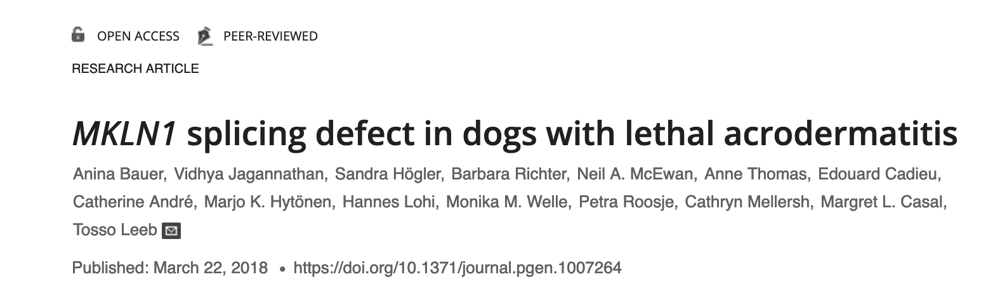

# Variant Calling


For Variant calling we continue with the same Bull terrier dogs.
One of the Bull Terrier dog suffers from Lethal acrodermatitis.
Lethal acrodermatitis is a autosomal recessive hereditary disease in dogs. It is characterized by poor growth, immune deficiency and characteristic skin lesions of the paws and of the face.


The causative mutation findings have been published in [PLOS Genetics](https://journals.plos.org/plosgenetics/article?id=10.1371/journal.pgen.1007264)




We will use the mapped bam files (from the mapping exercise) of two Bull terrier dogs to repeat the same findings of this paper.

## 1️⃣  Duplicate Marking

Commonly seen issue with resequencing genomes is sequence duplication i.e. over representation of certain reads, which could be an read artifacts sampled from the exact template of DNA. This need to be identified and marked/removed as they could be overrepresented evidence for false variants.

In the following exercise we will use [_picard tools_](https://broadinstitute.github.io/picard/). PICARD tools have been fully integrated into the GATK package. Our goal is to identify and mark duplicate reads in the BAM file. We will  mark the duplicates, rather than remove them from the bam files. This allows downstream variant calling tools to downweight these duplicates, improving accuracy.

```shell
cd variantCalling
mkdir markduplicates && cd markduplicates
```

Create a new script file called markduplicates.sh and save it in the folder markduplicates. Add the following lines to the script. Replace the email parameter with your own email id.

 ```

 #!/bin/bash
# Slurm options
#SBATCH --mail-user=<your.email@example.com>
#SBATCH --mail-type=fail,end
#SBATCH --job-name="markDuplicates"
#SBATCH --chdir=.
#SBATCH --time=3:00:00
#SBATCH --mem=4G
#SBATCH --partition=pcourseb
#SBATCH --output=markDuplicates_%j.out
#SBATCH --error=markDuplicates_%j.err

module load GATK/4.2.6.1-GCCcore-10.3.0-Java-11
module load Java/17.0.6

gatk MarkDuplicates INPUT=BT134.sorted.bam OUTPUT=BT134.dedup.bam REMOVE_DUPLICATES=FALSE METRICS_FILE=BT134.marked_dup_metrics.txt

```

Question:
1. Why are we marking the duplicates rather than removing them ?
2. What info does the metrics file contain ?

### Task
Repeat the same duplication marking with the BT012 genome bam file.

##### indexing the dedup file

```

# !/bin/bash
# Slurm options
#SBATCH --mail-user=<your.email@example.com>
#SBATCH --mail-type=fail,end
#SBATCH --job-name="idxDedup"
#SBATCH --chdir=.
#SBATCH --time=1:00:00
#SBATCH --mem=2G
#SBATCH --partition=pcourseb
#SBATCH --output=idxDedup_%j.out
#SBATCH --error=idxDedup_%j.err

module load SAMtools/1.13-GCC-10.3.0

samtools index BT134.dedup.bam
samtools index BT012.dedup.bam

```

### Deduplication file
If the deduplication step is taking two long, you can copy the dedup bam and index files from the courseb dir to your dir and you can go on to the  _HaplotypeCaller_ step.

```shell
cp /data/courses/courseB/variantCalling/BT012.dedup.bam .
cp /data/courses/courseB/variantCalling/BT012.dedup.bam.bai .
cp /data/courses/courseB/variantCalling/BT134.dedup.bam .
cp /data/courses/courseB/variantCalling/BT134.dedup.bam.bai .

```

### 2️⃣ Recalibration

The next step in variant calling base quality recalibration. Many studies showed that the raw Phred-scaled quality scores were frequently inaccurate and hece the [_BQSR_ tool](https://gatk.broadinstitute.org/hc/en-us/articles/360035890531-Base-Quality-Score-Recalibration-BQSR)  from  GATK recalibrates the base quality score to make them more accurately refelect the true error rate.

As this step takes too long to finish we will skip this step for this exercises and move to variant calling with haplotypeCaller.

### 3️⃣ HaplotypeCaller
[_GATK HaplotypeCaller_](https://gatk.broadinstitute.org/hc/en-us/articles/360037225632-HaplotypeCaller) calls both SNP and indel variants simultaneously via local de-novo assembly of haplotypes. Essentially, when this variant caller finds a region with signs of variation, it tosses out the old alignment information (from BWA MEM) and performs a local realignment of reads in that region.

Create variants directory and create job script in the variant directory

```shell
cd ../
mkdir variants && cd variants

```

Create the below script with VScode, save it as hapCall.sh and launch the job.

```

 #!/bin/bash
# Slurm options
#SBATCH --mail-user=<your.email@example.com>
#SBATCH --mail-type=fail,end
#SBATCH --job-name="varCalls"
#SBATCH --chdir=.
#SBATCH --time=3:00:00
#SBATCH --mem=2G
#SBATCH --partition=pcourseb
#SBATCH --output=hapCall_%j.out
#SBATCH --error=hapCall_%j.err

module load GATK/4.2.6.1-GCCcore-10.3.0-Java-11
module load Java/17.0.6

gatk HaplotypeCaller -R  ../refIdx/chr14.fa -I ../mapping/BT012.dedup.bam -I ../mapping/BT134.dedup.bam  -O BT.vcf

```

The output is _variant call format_ (VCF) file which is a tab delimited text file containing informations for the all the variants the tool found.

### 4️⃣ Hard Filtering Variants
The next step is  to  hard filter variants based on the statistical data from HaplotypeCaller.Each variant has statistical annotations like
- how many reads covered it,
- how many reads covered each allele,
- what proportion of reads were in forward vs reverse orientation
- etc
The hard filtering process involves establishing thresholds for each annotation; any variant with a value that is either below or above the defined range will be filtered out.

More information can be obtained on the [GATK hard filtering tutorial page](https://gatk.broadinstitute.org/hc/en-us/articles/360035890471-Hard-filtering-germline-short-variants)

### 5️⃣ SelectVariants
We perform hard filtering separately for SNPs and Indels. Therefore, the first step is to use GATK's _SelectVariants_ tool to subset the SNPs and Indels from the HaplotypeCaller output VCF file.

In the variants folder create the following script.

```

# !/bin/bash
# Slurm options
#SBATCH --mail-user=<your.email@example.com>
#SBATCH --mail-type=fail,end
#SBATCH --job-name="selectSNVs"
#SBATCH --chdir=.
#SBATCH --time=1:00:00
#SBATCH --mem=2G
#SBATCH --partition=pcourseb
#SBATCH --output=selectVar_%j.out
#SBATCH --error=selectVar_%j.err

module load GATK/4.2.6.1-GCCcore-10.3.0-Java-11
module load Java/17.0.6

gatk SelectVariants -V BT.vcf -select-type INDEL -O BT.indels.vcf
gatk SelectVariants -V BT.vcf -select-type SNP -O BT.snps.vcf

```

### Variant Filtration
Generate the following variant filtering script
```
# !/bin/bash
# Slurm options
#SBATCH --mail-user=<your.email@example.com>
#SBATCH --mail-type=fail,end
#SBATCH --job-name="filterSNVs"
#SBATCH --chdir=.
#SBATCH --time=1:00:00
#SBATCH --mem=2G
#SBATCH --partition=pcourseb
#SBATCH --output=fltVar_%j.out
#SBATCH --error=fltVar_%j.err

module load GATK/4.2.6.1-GCCcore-10.3.0-Java-11
module load Java/17.0.6

gatk VariantFiltration -V BT.snps.vcf -O BT.flt.snps.vcf -filter "QD < 2.0" --filter-name "QD2" -filter "QUAL < 30.0" --filter-name "QUAL30" -filter "SOR > 3.0" --filter-name "SOR3" -filter "FS > 60.0" --filter-name "FS60" -filter "MQ < 40.0" --filter-name "MQ40" -filter "MQRankSum < -12.5" --filter-name "MQRankSum-12.5" -filter "ReadPosRankSum < -8.0" --filter-name "ReadPosRankSum-8"
gatk VariantFiltration -V BT.indels.vcf -O BT.flt.indels.vcf -filter "QD < 2.0" --filter-name "QD2" -filter "QUAL < 30.0" --filter-name "QUAL30" -filter "FS > 200.0" --filter-name "FS200" -filter "ReadPosRankSum < -20.0" --filter-name "ReadPosRankSum-20"

```

Once the variants are filtered, we use GATK's _MergeVCFs_ tool to merge the VCF files back into a single output, preparing them for the next step: annotation, which adds the genomic context to each variant.
```

# !/bin/bash
# Slurm options
#SBATCH --mail-user=<your.email@example.com>
#SBATCH --mail-type=fail,end
#SBATCH --job-name="mergeSNVs"
#SBATCH --chdir=.
#SBATCH --time=1:00:00
#SBATCH --mem=2G
#SBATCH --partition=pcourseb
#SBATCH --output=mergeVar_%j.out
#SBATCH --error=mergeVar_%j.err

module load GATK/4.2.6.1-GCCcore-10.3.0-Java-11
module load Java/17.0.6

gatk MergeVcfs -I BT.flt.snps.vcf -I BT.flt.indels.vcf -O BT.flt.var.vcf

```

### Task
Use a Unix command to check:
- total number of variants in the vcf file.
- total number "PASS" variants in the vcf file.

### 7️⃣ Variant annotation and effect prediction
To determine the effect of the variants, we will employ [‘snpeff’](http: //snpeff.sourceforge.net/). This process requires two main steps:

- Database Creation: Building a specialized effect prediction database based on our reference and annotation data.
- Prediction Run: Running the variant file against this database.

The final output is a VCF file where each variant entry includes a new 'ANN' field, providing its predicted functional consequence."

The following script accomplishes two main tasks:

- Downloads the Effect database: This database will be used for both annotating genetic variants and predicting their effects.
- Annotates the VCF file: It adds information from the Effect database to the variants in your VCF file, providing valuable context and insights.

```
#!/bin/bash
# Slurm options
#SBATCH --mail-user=<your.email@example.com>
#SBATCH --mail-type=fail,end
#SBATCH --job-name="Effdb"
#SBATCH --chdir=.
#SBATCH --time=1:00:00
#SBATCH --mem=2G
#SBATCH --partition=pcourseb
#SBATCH --output=annVar_%j.out
#SBATCH --error=annVar_%j.err

# This line creates a shortcut called 'snpEff' for running the SnpEff program
snpEff="apptainer exec -B /home/<student>/course/variantCalling/variants /mnt/containers/apptainer/snpeff:5.3.0a--hdfd78af_0 snpEff"

# Download the dog genome database (CanFam3.1.99)
$snpEff download \
    -dataDir /home/<student>/course/variantCalling/variants \
    -v CanFam3.1.99

# Annotate your variants using the downloaded database
$snpEff eff \
    -dataDir /home/<student>/course/variantCalling/variants \
    CanFam3.1.99 ../variants/BT.flt.var.vcf > ../variants/BT.ann.vcf
```

The output VCF file has an extra field "ANN"

If the snpEff database fails to load the CanFam3.1.99 database. A copy the annotated VCF file  is available in /data/courses/courseB/variantCalling dir to do the below task.

```
cp /data/courses/courseB/variantCalling/BT.ann.vcf .
```

### Task
1. use a unix command to check for ANN field in the VCF file.
2. Use the following command to see if the variant implicated for the LAD in Bull terriers is found in the VCF file.

```
 awk '{if($2 == 5731405) print $_}'  BT.ann.vcf
```

##### Question
In which genome is the variant found and what is the effect prediction for the variant.

#### Add the folders/script files to git repository and push it to your remote rep. (Think of the files you want to add to .gitignore before pushing to the remote repo.). Also update your README.md file accordingly.