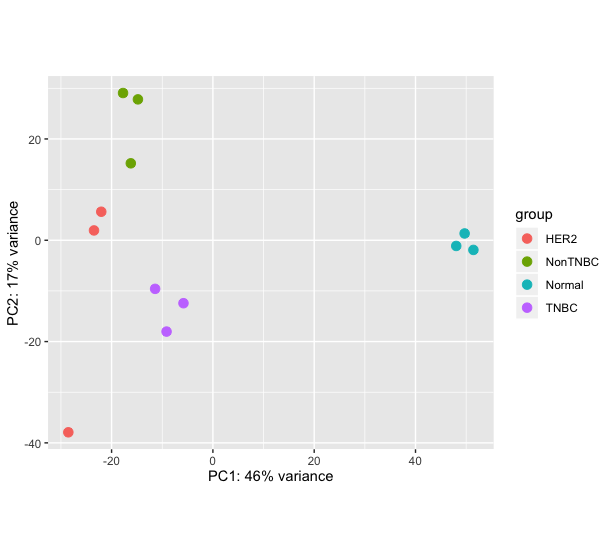
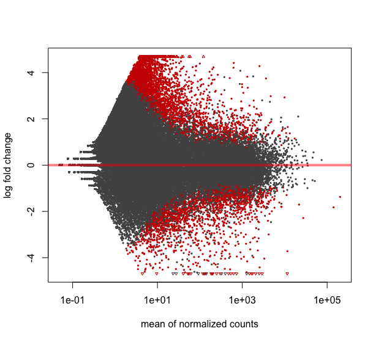
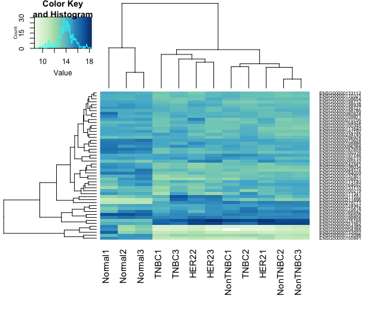

# Differential expression using RNA-seq
For this exercise we will use the datasets from the study [GSE52194](https://www.ncbi.nlm.nih.gov/geo/query/acc.cgi?acc=GSE52194)

The results of the analysis of this dataset had been published in the following paper https://www.nature.com/articles/srep01689

We will use a subset only for the analysis.

1. Fastq files can be downloaded through Gene Expression Omnibus (GEO): GSE52194 (https://www.ncbi.nlm.nih.gov/geo/query/acc.cgi?acc=GSE52194)
2. The libaray layout is paired sequencing
3. Library prep protocol did not preserve information on the transcribed strand. (non-stranded)

Background:

3 samples each from normal breast tissue and 3 different breast cancer subtypes:
- Triple negative
- HER2 positive
- Non-triple negative (Luminal A/B)

### Learning Objectives

1. Assess read number and quality
2. Map the reads to the human reference genome GRCh38
3. Count the number of reads overlapping annotated genes
4. Test for differential gene expression between tumor subtypes

In order reduce run times again we have subset of clean reads only for chr22 at _/data/courses/courseB/RNA-seq/reads_

## 1️⃣  Mapping
Create the following directory structure: course/RNA_seq/mapping.

```shell
cd course
mkdir -p RNA_seq/scripts
mkdir -p RNA_seq/reads
mkdir -p RNA_seq/logs
mkdir -p RNA_seq/mapped_files
mkdir -p RNA_seq/feature_counts
cd RNA_seq/reads
```

There are three replicates for each condition. Due to time constraints, you  will  analyze  only one sample.  Choose one of the paired-end reads samples from the folder /data/courses/courseB/RNA-seq/reads directory and copy its files into your course/RNA_seq/mapping directory. In the script below replace the sample name (HER21)with the one you have chosen.

```
cp /data/courses/courseB/RNA-seq/reads/HER21*_R*.fastq.gz  .
cd ../scripts
```

We will map these human breast cancer RNA-seq reads to the human reference genome (GRCh38) using the [HiSat2 algorithm](https://ccb.jhu.edu/software/hisat2/manual.shtml). HiSat2, which succeeds TopHat2, is a BWT-based aligner distinguished by its use of two indexing systems (global and local) to efficiently handle two types of reads: those that map to exons and those that span one or more splice junctions.

Write a job script and submit the mapping job to the cluster using sbatch. Save this file as hisat2.sh in the course/RNA_seq/scripts directory.

```
#!/bin/bash
#SBATCH --mail-user=<your.email@example.com>
#SBATCH --mail-type=fail,end
#SBATCH --time=3:00:00
#SBATCH --mem=16G
#SBATCH --output=hisat2.out
#SBATCH --error=hisat2.err
#SBATCH --job-name=hisat2
#SBATCH --cpus-per-task=4
#SBATCH --partition=pcourseb
#SBATCH --output=/home/student47/course/RNA_seq/logs/RNAseq_map_%j.out
#SBATCH --error=/home/student47/course/RNA_seq/logs/RNAseq_map_%j.err

module load HISAT2/2.2.1-gompi-2021a
hisat2 -x /data/courses/courseB/RNA-seq/reference/Homo_sapiens.GRCh38.dna.chromosome.22  -1 /data/courses/courseB/RNA-seq/reads/HER21_chr22_R1.fastq.gz -2 /data/courses/courseB/RNA-seq/reads/HER21_chr22_R2.fastq.gz -S /home/student47/course/RNA_seq/mapped_files/HER21.sam -p 4
```

The SAM file output from HiSat2 must be converted to a BAM file and then sorted by chromosomal coordinates for all subsequent downstream analysis.

### 2️⃣  Convert SAM to BAM
Write a job script to convert the sam to bam file using _samtools view_ and _samtools sort_

```
#!/bin/bash
#SBATCH --mail-user=<your.email@example.com>
#SBATCH --mail-type=fail,end
#SBATCH --time=3:00:00
#SBATCH --mem=16G
#SBATCH --output=bam.out
#SBATCH --error=bam.err
#SBATCH --job-name=view2bam
#SBATCH --cpus-per-task=8
#SBATCH --partition=pcourseb
#SBATCH --output=/home/student47/course/RNA_seq/logs/RNAseq_map_%j.out
#SBATCH --error=/home/student47/course/RNA_seq/logs/RNAseq_map_%j.err

module load SAMtools/1.13-GCC-10.3.0

samtools view -@8 -h -Sb -o /home/student47/course/RNA_seq/mapped_files/HER21.bam /home/student47/course/RNA_seq/mapped_files/HER21.sam
samtools sort -@8 /home/student47/course/RNA_seq/mapped_files/HER21.bam -o /home/student47/course/RNA_seq/mapped_files/HER21.sorted.bam
```

Always verify the output and quality of your results before continuing the analysis. You can check the mapping quality by reviewing the summary statistics HiSat2 reported in its error file.

The mapping stats for all files are available here /data/courses/courseB/RNA-seq/mappingstats/

Use those files and unix command line tools to answer the following questions
- What is the highest/lowest overall alignment rate?
- What is the minimum/maximum number of reads that aligned concordantly and to a unique location of the genome?

### 3️⃣ Count reads aligned to genes
To count the number of reads overlapping annotated genes we will use the [featureCounts algorithm](https://subread.sourceforge.net/featureCounts.html).

The sorted BAM files for all samples, which are required for the feature counting step, have already been provided. You can use these files directly as input for your feature count tool. Save this file as featureCounts.sh in the course/RNA_seq/scripts directory.

```
#!/bin/bash
#SBATCH --mail-user=<your.email@example.com>
#SBATCH --mail-type=fail,end
#SBATCH --time=10:00:00
#SBATCH --mem=16G
#SBATCH --job-name=featureCounts
#SBATCH --cpus-per-task=8
#SBATCH --partition=pcourseb
#SBATCH --output=/home/student47/course/RNA_seq/logs/RNAseq_map_%j.out
#SBATCH --error=/home/student47/course/RNA_seq/logs/RNAseq_map_%j.err

module load Subread/2.0.3-GCC-10.3.0

featureCounts -p -C -s 0 -T 8 -Q 10 --tmpDir .  -a  /data/courses/courseB/RNA-seq/reference/Homo_sapiens.GRCh38.98.gtf -t exon -g gene_id  -o /home/student47/course/RNA_seq/feature_counts/output.txt  /data/courses/courseB/RNA-seq/mapping/HER21.sorted.bam /data/courses/courseB/RNA-seq/mapping/HER22.sorted.bam /data/courses/courseB/RNA-seq/mapping/HER23.sorted.bam /data/courses/courseB/RNA-seq/mapping/NonTNBC1.sorted.bam /data/courses/courseB/RNA-seq/mapping/NonTNBC2.sorted.bam /data/courses/courseB/RNA-seq/mapping/TNBC3.sorted.bam /data/courses/courseB/RNA-seq/mapping/Normal1.sorted.bam /data/courses/courseB/RNA-seq/mapping/Normal2.sorted.bam /data/courses/courseB/RNA-seq/mapping/Normal3.sorted.bam /data/courses/courseB/RNA-seq/mapping/TNBC1.sorted.bam /data/courses/courseB/RNA-seq/mapping/TNBC2.sorted.bam /data/courses/courseB/RNA-seq/mapping/TNBC3.sorted.bam
```

The parameters used for featureCount is as follows:
- -p the read sequence is paired-end data.
- -C If specified, the chimeric fragments (those fragments that have their two ends aligned to different chromosomes) will NOT be counted. This option should be used together with -p (or isPairedEnd in Rsubread featureCounts)
- -s Indicate if strand-specific read counting should be performed 0 (un- stranded), 1 (stranded) and 2 (reversely stranded)
- -T Number of the threads.
- -Q The minimum mapping quality score a read must satisfy in order to be counted.
- --tmpDir Directory under which intermediate files are saved (later re- moved)
- -a annotation file to be used for counting
- -t Specify the feature type
- -g Specify the attribute type used to group features (eg. exons) into meta-features (eg. genes)

Check the output of featureCounts to address the following questions:
- How many reads overlaps with annotated genes in each sample?
- How many reads, on average, are unassigned due to ambiguity? 
- How many reads, on average, are unassigned due to multimapping? 

### 4️⃣ Differential expression.

We will use the count file to study differential expression of genes in the three breast cancer sub-types with R package called [DeSeq2](http://bioconductor.org/packages/release/bioc/html/DESeq2.html)

For convience we have produced the full feature count file for all chromosomes, for all the samples,  ready to use for differential expression with R.

Open R studio and in the text editor panel add the following R commands and run the commands in the console window.
The first two lines below are to install the DeSeq2 package. If don't have it already.

```r
if (!require("BiocManager", quietly = TRUE))
    install.packages("BiocManager")

BiocManager: :install("DESeq2")
```

### Prepare the data for analysis.
1. Read in data table. Reformat so that it contains the Geneid as rownames and only the counts as columns. It is also a good idea to simplify the column names (if you haven’t already done this)

2. Create a data frame containing the experimental group of each sample

3. Create the DESeqDataSet object

Note: the first command in R **setwd** should be given the full path to your _diffExp_ folder. This folder is where you want add your results and plots of analysis on your local computer

```r
setwd("diffExp")
library(DESeq2)
# The file contains gene expression counts from the three breast tissues
countData<-read.table('https://github.com/vetsuisse-unibe/NGS-course-docs/raw/refs/heads/master/breastCancer.counts.forDESeq.txt', header=TRUE)
# Set the row names of the data frame to be the gene IDs
# This assumes there's a column named 'Geneid' in the input file
rownames(countData)<-countData$Geneid
# Remove the Geneid column since it's now used as row names
# This keeps only the count data columns
countData<-countData[, -1]
# Clean up the column names using regular expression
# Extracts only the sample names from complex BAM file names
# Pattern explanation:
# .*\.bamfiles\. : matches any text followed by '.bamfiles.'
# ([A-Za-z1-3]*) : captures letters and numbers 1-3
# \.coordSorted\.bam : matches '.coordSorted.bam'
# The \\1 replacement keeps only the captured group
colnames(countData)<-sub(".*\\.bamfiles\\.([A-Za-z1-3]*)\\.coordSorted\\.bam", "\\1", colnames(countData))

# Create sample groups by removing the last character from each sample name
# This removes the replicate number, leaving only the cancer subtype
sampleGroup<-sub(".$", "", colnames(countData))

# Create a data frame with sample information (metadata)
# 'condition' column contains the cancer subtypes as factors
colData<-data.frame(condition=factor(sampleGroup))

# Create a DESeq2 dataset object
# Parameters:
# countData: matrix of count data
# colData: sample metadata
# formula(~condition): specifies that we want to test for differences between conditions
dds<-DESeqDataSetFromMatrix(countData, colData, formula(~condition))
```

### Perform the differential expression analysis

```r
# Parameters:
# dds: the DESeqDataSet object created earlier
# betaPrior=TRUE: uses a beta prior distribution for fold changes,
# which helps moderate extreme fold changes when sample size is small
dds<-DESeq(dds, betaPrior = TRUE)
# Extract the results from the DESeq analysis
# This creates a results table containing:
# - log2 fold changes
# - p-values
# - adjusted p-values
# - base means
res <-results(dds)
# Display the first few lines of the results

head(res)

```

The output will show:
- baseMean: average expression level across all samples
- log2FoldChange: log2 of the fold change between conditions
- lfcSE: standard error of the log2 fold change
- stat: the test statistic used
- pvalue: raw p-value
- padj: FDR value

### 6️⃣ Visualize results
Plot 1: PCA using the 500 most variably expressed genes

```r
# Apply regularized log transformation to the count data
# Parameters:
# dds: DESeqDataSet object containing count data
# blind=TRUE: transformation is blind to the experimental design
# (recommended for quality assessment)
# This transformation:
# - Minimizes differences between samples for rows with small counts
# - Normalizes for library size
# - Makes data more homoskedastic (similar variance across mean)
rld <-rlog(dds, blind=TRUE) # apply a regularized log transformation, ignoring information about experimental groups
# Create a PCA plot of the samples
# Parameters:
# rld: transformed data from rlog()
# intgroup="condition": tells the function to color points by condition/group
# PCA helps visualize:
# - Sample clustering
# - Batch effects
# - Outliers
p<-plotPCA(rld, intgroup=c("condition"))
# Display the PCA plot
# Parameters:
# ntop=500: uses only the top 500 most variable genes for the PCA
# This helps focus on genes that show the most variation across samples
print(p, ntop=500)
```


Plot 2: Mean expression against log-fold change. Genes with p-adjusted below alpha will be shown in red, all others in grey

```r
# Create an MA plot to visualize the relationship between mean expression and log2 fold changes
# Parameters:
# res: DESeq2 results object containing differential expression statistics
# alpha=0.05: significance level for highlighting differentially expressed genes
# Plot interpretation:
# - X-axis: mean expression across all samples (baseMean)
# - Y-axis: log2 fold change
# - Red dots: significantly differentially expressed genes (padj < 0.05)
# - Black dots: genes not significantly differentially expressed
# - Points above 0 on Y-axis: upregulated genes
# - Points below 0 on Y-axis: downregulated genes
plotMA(res, alpha=0.05)
```


Plot 3: Heatmap using the 50 most highly expressed genes

```r
# Load required libraries for plotting
# For color palettes
library("RColorBrewer")
# For enhanced heatmap functionality
library("gplots")
# Select the top 50 highest expressed genes
# Steps:
# 1. Get normalized counts using counts(dds, normalized=TRUE)
# 2. Calculate mean expression for each gene using rowMeans()
# 3. Order genes by decreasing mean expression using order()
# 4. Select top 50 genes using [1: 50]
select <- order(rowMeans(counts(dds,normalized=TRUE)),decreasing=TRUE)[1: 50]
# Create a blue-green color gradient for the heatmap
# Parameters:
# brewer.pal(9, "GnBu"): Get 9 colors from the Green-Blue palette
# colorRampPalette(...)(100): Interpolate to create 100 colors
hmcol <- colorRampPalette(brewer.pal(9, "GnBu"))(100)
# Generate heatmap of gene expression
# Parameters:
# assay(rld)[select,]: Get normalized expression values for selected genes
# col = hmcol: Use the created color palette
# trace="none": Remove trace lines from heatmap
# margin=c(10,6): Set margins for row and column labels
# labCol=colnames(dds): Use sample names as column labels
# cexRow = 1/log10(length(select)): Scale row labels based on number of genes
# This heatmap shows:
# - Expression patterns across samples
# - Sample clustering (dendrogram on top)
# - Gene clustering (dendrogram on side)
# - Relative expression levels (color intensity)
heatmap.2(assay(rld)[select,], col = hmcol, trace="none", margin=c(10,6),labCol=colnames(dds), cexRow = 1/log10(length(select)))
```



**Optional task: Try to recreate the VOLCANO PLOT looking at the [manual](http: //bioconductor.org/packages/release/bioc/html/DESeq2.html).**
```r
plot(TNBC_HER2$log2FoldChange, -log10(TNBC_HER2$pvalue), 
     xlab="log2 Fold Change", ylab="-log10(p-value)",
     pch=20, cex=0.5, col="gray")

# Highlight significant genes
points(TNBC_HER2$log2FoldChange[which(TNBC_HER2$padj < 0.05 & abs(TNBC_HER2$log2FoldChange) > 1)],
       -log10(TNBC_HER2$pvalue[which(TNBC_HER2$padj < 0.05 & abs(TNBC_HER2$log2FoldChange) > 1)]),
       col="red", pch=20, cex=0.5)

# Add threshold lines
abline(h=-log10(0.05), col="blue", lty=2)
abline(v=c(-1, 1), col="blue", lty=2)
```
#### Pairwise contrasts
Now take a closer look at the results and the normalised count data:

```r
head(res)
head(counts(dds, normalized=TRUE))
```

The log2FoldChange is approximately the mean of the normalised counts for condition 1 over the mean of the normalised counts for conditions 2 (“approximately”, because of the shrinkage explained in the lecture)

In our dataset, we have more than 2 groups, i.e. our factor “condition” has more than 2 levels. In this situation, DESeq2 by default outputs a comparison of the last level of the factor over the first level (in alphabetical order), in our case TNBC vs HER2 (see “Note on factor levels” in DESeq2 vignette)

We can explicitly specify which levels we want to compare, as follows:

```r
TNBC_HER2 <-results(dds, contrast=c('condition', 'TNBC', 'HER2' ))
```

Let’s double-check that this really produces exactly the same results as before by comparing the log2 fold changes:

```r
plot(res$log2FoldChange, TNBC_HER2$log2FoldChange, xlab='first analysis', ylab='second analysis')
```

**Extra task: Perform some of the other pairwise comparisons that are possible for this dataset**

#### Export the results to a tab-delimited file

Our variable ‘res’ contains only the results from the test for differential expression. Before we export this as a table, we add the original counts for each gene in each sample. We then export the original table and a table sorted by adjusted P-values

```r
combined <- cbind(counts(dds), as.data.frame(res)) # This assumes that the genes are in the same order in both tables!
# alteratively, we could use the normalised counts by using counts(dds, normalized=TRUE)
write.table(combined, 'MyResults.txt', quote=FALSE, row.names=TRUE, sep='\t')
write.table(combined[order(combined$padj),], 'MyResults_sorted.txt', quote=FALSE, row.names=TRUE, sep='\t')
```